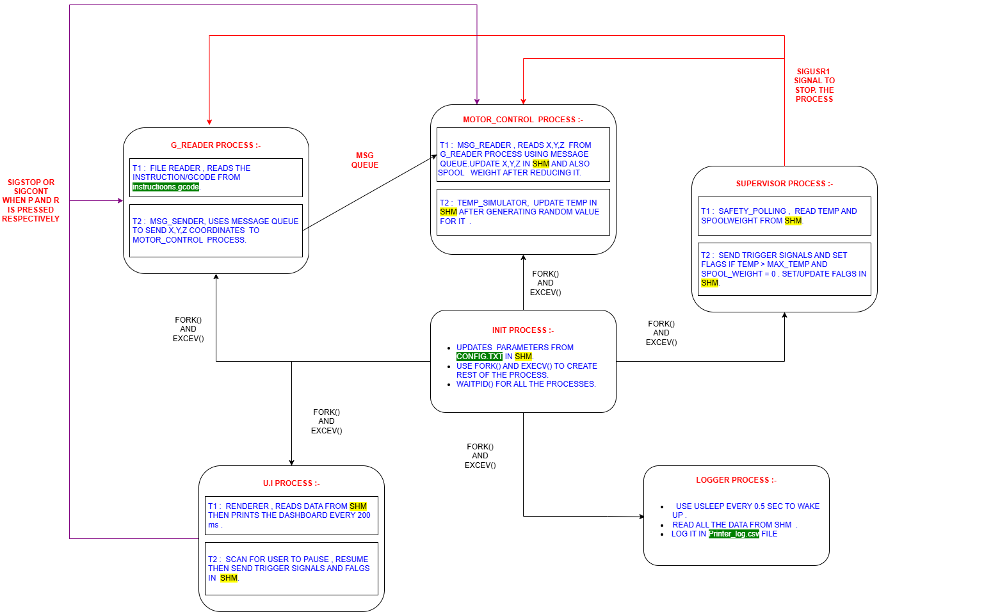

# 3D-Printer-Simulation
A concurrent system simulation of a 3D printer using POSIX threads, process control, shared memory, message queues, and signal handling.

## Project Overview

This project simulates a 3D printer system using Linux system calls and POSIX APIs. The system models a real-world 3D printing pipeline where multiple subsystems operate concurrently.

The objective is to demonstrate key operating system concepts:

- Process creation and management
- Multithreading
- Inter-process communication (IPC)
- Synchronization using mutexes
- Signal handling
- Real-time system visualization

The system is implemented in C and runs on a Linux environment.

---

## Scenario Description

A real 3D printer consists of multiple components working simultaneously:

- A controller reads G-code instructions
- Motors execute movement commands
- Temperature is continuously monitored
- A supervisor ensures safe operation
- A UI displays real-time printer state

This project simulates these components using independent processes and threads that communicate using IPC mechanisms.

---

## System Architecture

### 1. Initialization Process (init.c)

Responsibilities:

- Creates shared memory and message queue
- Initializes global printer state
- Reads configuration parameters
- Spawns all system processes using `fork()` and `execl()`
- Stores child PIDs in shared memory
- Waits for execution and performs cleanup

---

### 2. G-code Reader Process (g_reader.c)

- Reads G-code instructions from file
- Implements producer-consumer model using threads:

#### Threads:
- File Reader Thread (Producer)
- Message Sender Thread (Consumer)

- Uses:
  - Mutex
  - Condition variables
- Sends commands to motor control via message queue
- Sends `"DONE"` when file processing completes

---

### 3. Motor Control Process (motor_control.c)

Handles core printer simulation.

#### Thread 1: Message Reader
- Receives commands from message queue
- Parses G-code (G0/G1)
- Updates X, Y, Z position in shared memory
- Simulates filament consumption

#### Thread 2: Temperature Simulator
- Updates temperature every second
- Increases temperature during printing
- Cools when idle
- Triggers emergency stop if temperature exceeds limit

---

### 4. Supervisor Process (supervisor.c)

Ensures system safety.

#### Thread 1: Safety Polling
- Monitors temperature and spool weight
- Stops system if limits are exceeded

#### Thread 2: Trigger Monitor
- Monitors shared memory flags:
  - `emergency_stop`
  - `job_done`
- Sends stop signals to worker processes

---

### 5. UI Process (ui.c)

Provides real-time terminal visualization.

Features:

- Displays two views:
  - Top View (X-Y plane)
  - Front View (X-Z plane)
- Shows:
  - Print head position
  - Temperature
  - Spool weight
  - System status

#### Threads:

- Renderer Thread:
  - Updates display continuously
  - Tracks filament placement

- Input Thread:
  - Handles user input in raw mode

#### Controls:

- `P` → Pause printing (SIGSTOP)
- `R` → Resume printing (SIGCONT)
- `Q` → Quit / Emergency stop (SIGUSR1)

Uses `termios` for non-blocking input.

---

## Process Design

The system consists of multiple concurrent processes:

Initialization Process  
-- G-code Reader  
-- Motor Control  
-- Supervisor  
-- UI  

Processes are created using `fork()` and executed using `execl()`.

---

## Inter-Process Communication (IPC)

### 1. Message Queue

Used for command transfer:

G-code Reader → Motor Control

Functions:

- `msgget()`
- `msgsnd()`
- `msgrcv()`

---

### 2. Shared Memory

Used for global system state:

- Position (X, Y, Z)
- Temperature
- Spool weight
- Flags:
  - `is_running`
  - `emergency_stop`
  - `job_done`

Functions:

- `shmget()`
- `shmat()`
- `shmdt()`

A mutex inside shared memory ensures safe concurrent access.

---

## Synchronization

- `pthread_mutex_t` used for shared memory protection
- Condition variables used in producer-consumer model
- Separate mutex used for UI grid updates

---

## Signal Handling

Signals are used for system control.

### SIGSTOP
Pauses printing (used by UI)

### SIGCONT
Resumes printing (used by UI)

### SIGUSR1
Triggers emergency stop

Used by:
- UI (quit)
- Supervisor (safety violation)
- Motor control (overtemperature)

---

## File Handling

Input:

- G-code instructions file

Configuration:

- Printer parameters (material, max temperature, etc.)

Output:

- Console-based real-time UI

---

## Simulation Features

- Movement delay using `usleep()`
- Temperature variation using `rand()`
- Continuous real-time updates
- Filament usage simulation


---

## Build Steps

```bash
make
```

---

## Run Instructions

```bash
./init
```
